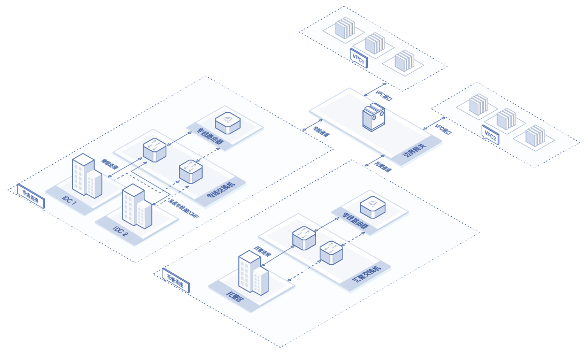
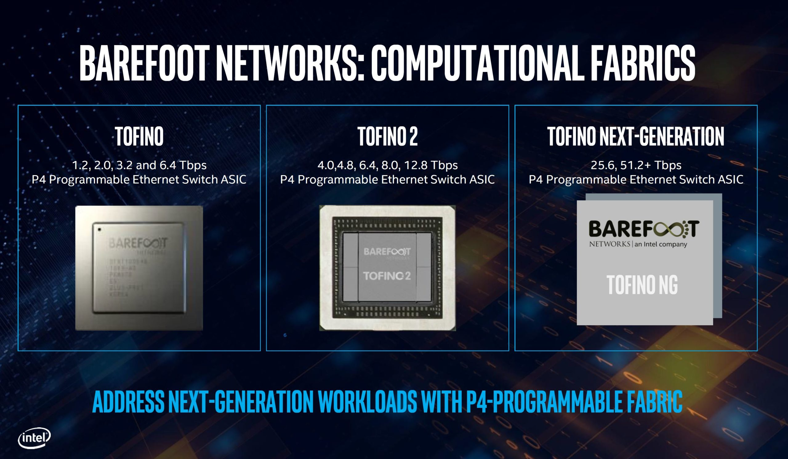

**目录导览**  
  [文章背景](#文章背景)  
  [网关问题分析](#网关问题分析)  
  [技术方案设计实现](#技术方案设计实现)  
  &nbsp;&nbsp;[网络拓扑规划与VIP架构升级](#网络拓扑规划与VIP架构升级)  
  &nbsp;&nbsp;[硬件实现与N-Tb流量平滑迁移](#硬件实现与N-Tb流量平滑迁移)  
  [落地实施经验](#落地实施经验)  
  &nbsp;&nbsp;[基于VIP架构的挑战和优化](#基于VIP架构的挑战和优化)  
  &nbsp;&nbsp;[Barefoot的Tofino硬件的限制和缺陷](#Barefoot的Tofino硬件的限制和缺陷)  
  [结论和未来的工作](#结论和未来的工作)   

**基本概念**  
> 边界网关(BGW，Border Gateway)，是京东云用来承载VPC南北向流量的一种网关，主要作用是与其他外部网关或环境进行内网互通。  
> 在边界网关支持创建VPC接口功能前，边界网关一旦创建、即自动与同地域的所有VPC连通。  
> 随着边界网关的VPC接口功能上线，新建的边界网关默认不与任何VPC连通，用户需要创建"VPC接口”用于打通指定VPC和边界网关的互联；对于已经创建的边界网关，边界网关路由表内已有到VPC的路由仍然有效可用，但是不能新建到VPC的路由、除非先创建出与VPC关联的VPC接口。  
> 目前边界网关承载的业务是专线连接、托管连接、VPN连接、VPC接口功能。  
> 边界网关支持客户IDC和京东云VPC之间通信、京东云托管区和京东云VPC之间通信、京东云同地域多个VPC之间通信等。  
> 默认情况下，连接到同一边界网关的专线通道、托管通道、VPN连接之间无法通过边界网关进行通信。  
> 通过边界网关可访问的京东云资源：京东云VPC内的全部资源，包括云主机、容器、负载均衡、云数据库、云缓存等，但是不能利用VPC内NAT网关统一互联网出口。  

# 文章背景
随着京东云线上运行规模不断扩大以及京东商城和京东物流等业务层面对延迟、带宽和稳定性的要求越来越高，采用DPDK报文处理的边界网关在横向纵向扩展都出现了局限性。在过去几年时间，京东云IaaS虚拟网络团队跟进业界，基于Barefoot的Tofino硬件可编程交换机实现了对专线网关的架构和性能升级。其中解决和克服了一些问题，在这里推荐给大家。

# 网关问题分析
## BGW专线网关机器运维变更困难  
融合网关中，在CPU上需要承担多个角色的实现，比如多个组件（例如IGW、BGW）的控制平面（这些控制平面需要负责接收远端控制器的表项推送，并作为接口处理模块，将表项通过驱动下发到硬件或软件的数据平面）、数据平面业务的转发（例如XGW、XLB）。  
控制层面可以通过集中控制的方式实现不同的业务逻辑：拓扑发现，路由管理，安全策略，网络虚拟化等。    
**当前最大一个jdos租户资源组在控制面下发过程中耗时接近3小时+，华北区域大客户资源组约50+，升级时间成本150h+（都为凌晨升级）**  

## BGW专线网关故障收敛链路复杂且长  

## BGW专线网关不具备异构架构下的灾备能力  

## BGW专线网关硬件资源成本居高不下  
云网络环境中，在计算节点DPDK不会占用过多的CPU，否则会影响CPU售卖，一般会使用1-2 CPU用于数据报文处理。同时DPDK 处理数据报文的性能强依赖CPU算力。因此在计算节点网络的横向扩展以及纵向扩展都具有局限性。  
在边际网关节点，我们可以通过扩展服务器的方式，提高网络处理容量进而满足业务需求。但是大规模的扩展服务器，需要承担更多的机器、功耗以及运维成本。  
**当前基于X86服务器机器达到250+，单台成本按照6万核算，成本接近1500万。**  

# 技术方案设计实现
## 网络拓扑规划与VIP架构升级

## 硬件实现与N-Tb流量平滑迁移

# 落地实施经验
在调研开发和最终落地过程中遇到诸多问题，在这里和大家总结分享下:
## 基于VIP架构的挑战和优化
1. 
2. 
3. 
4. 
## Barefoot的Tofino硬件的限制和缺陷
1. ONL操作环境与传统软件架构集成
2. pipeline的流表条目数量限制
3. MAC地址对VxLAN的影响
4. pipeline的限速表项占满，有概率出现限速失效
5. pipeline的在双限速表放置同一个stage下，有概率出现限速互相冲突

# 结论和未来的工作
**结论**  
* **本次基于Barefoot的Tofino硬件可编程交换机的落地实践补充了京东云在可编程芯片领域的技术积累**  
* **本次基于VIP网络拓扑架构下的实施能够给后续京东云虚拟网络网关产品提供充足的实践经验**  

**未来工作**  
* Tofino硬件可编程交换机面临当前中美贸易战和信创目标的双重挑战，下一步需要可靠的国产替代（例如中兴）
* 对于传统业务和新增长业务在可编程芯片上性能优化、稳定性提升和降本增效的探索（例如：精准限速）
* 除专线边界网关外在统一公网网关（例如：弹性公网IP和IPv6公网产品等）进行更深一步的落地