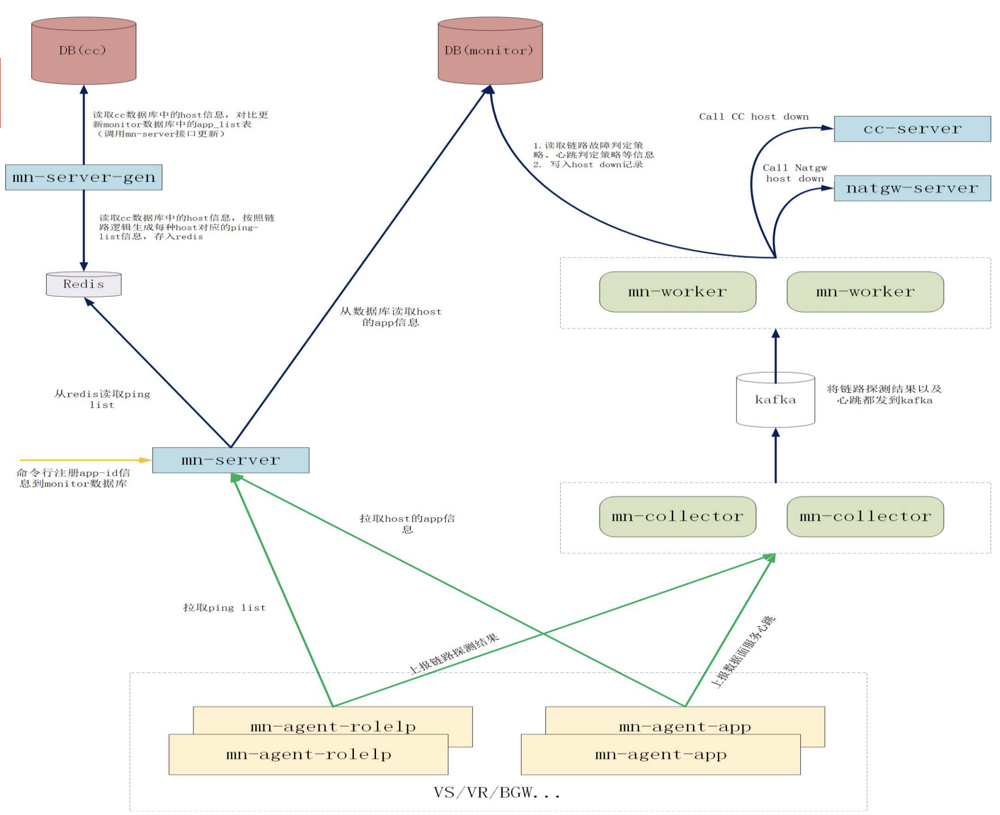
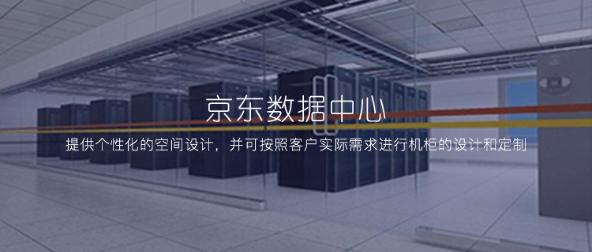
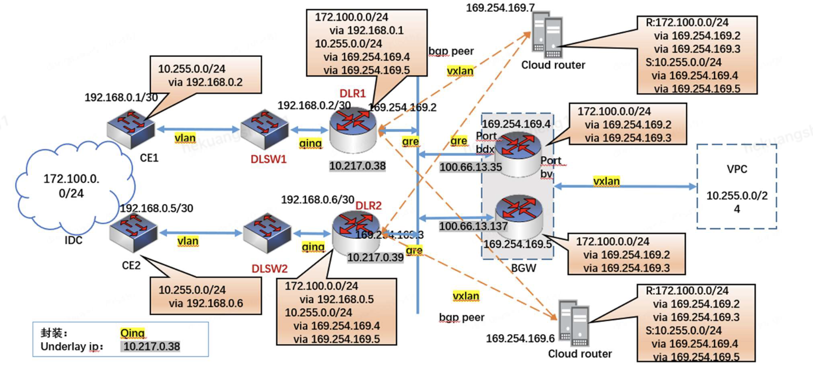
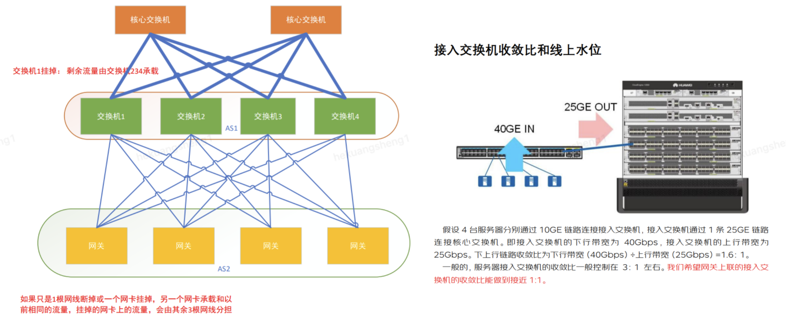
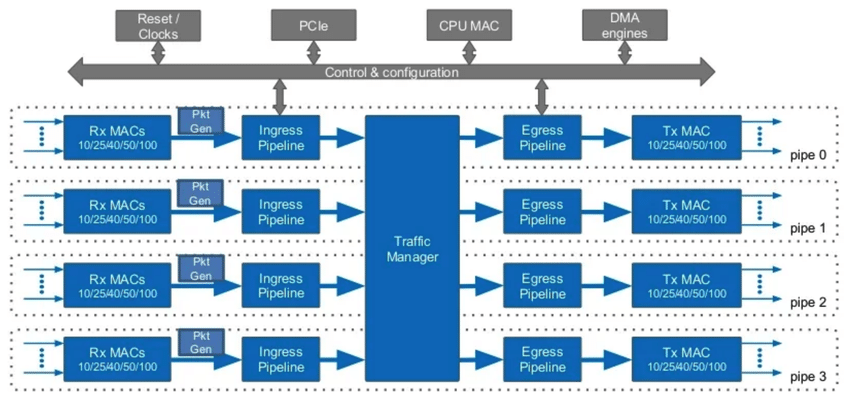
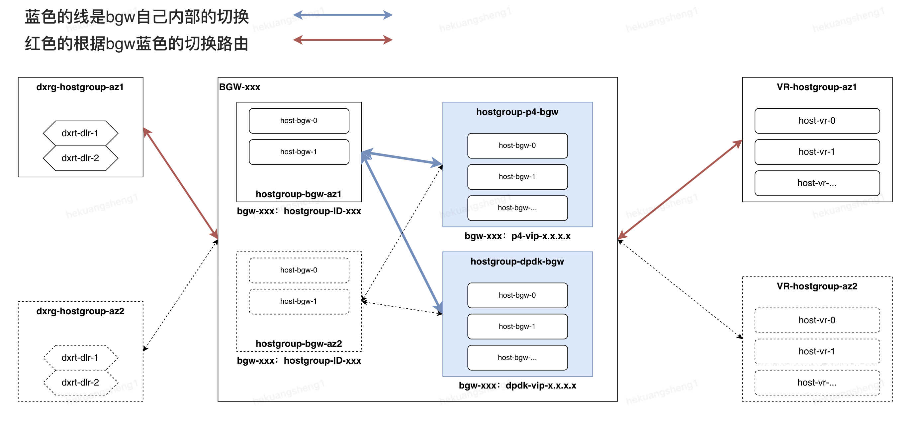

**目录导览**  
  [文章背景](#文章背景)  
  [一.网关问题分析](#一.网关问题分析)  
  &nbsp;&nbsp;[BGW专线网关机器运维变更困难](#BGW专线网关机器运维变更困难)  
  &nbsp;&nbsp;[BGW专线网关故障收敛链路复杂且长](#BGW专线网关故障收敛链路复杂且长)  
  &nbsp;&nbsp;[BGW专线网关不具备异构架构下的灾备能力](#BGW专线网关不具备异构架构下的灾备能力)  
  &nbsp;&nbsp;[BGW专线网关硬件资源成本居高不下](#BGW专线网关硬件资源成本居高不下)  
  [二.技术方案设计实现](#二.技术方案设计实现)  
  &nbsp;&nbsp;[网络拓扑规划与VIP架构升级](#网络拓扑规划与VIP架构升级)  
  &nbsp;&nbsp;[硬件实现与N-Tb流量平滑迁移](#硬件实现与N-Tb流量平滑迁移)  
  [三.落地实施经验](#三.落地实施经验)  
  &nbsp;&nbsp;[基于VIP架构的挑战和优化](#基于VIP架构的挑战和优化)  
  &nbsp;&nbsp;[Barefoot的Tofino硬件的限制和缺陷](#Barefoot的Tofino硬件的限制和缺陷)  
  [四.结论和未来的工作](#四.结论和未来的工作)   

**基本概念**  
> 边界网关(BGW，Border Gateway)，是京东云用来承载VPC南北向流量的一种网关，主要作用是与其他外部网关或环境进行内网互通。  
> 在边界网关支持创建VPC接口功能前，边界网关一旦创建、即自动与同地域的所有VPC连通。  
> 随着边界网关的VPC接口功能上线，新建的边界网关默认不与任何VPC连通，用户需要创建"VPC接口”用于打通指定VPC和边界网关的互联；对于已经创建的边界网关，边界网关路由表内已有到VPC的路由仍然有效可用，但是不能新建到VPC的路由、除非先创建出与VPC关联的VPC接口。  
> 目前边界网关承载的业务是专线连接、托管连接、VPN连接、VPC接口功能。  
> 边界网关支持客户IDC和京东云VPC之间通信、京东云托管区和京东云VPC之间通信、京东云同地域多个VPC之间通信等。  
> 默认情况下，连接到同一边界网关的专线通道、托管通道、VPN连接之间无法通过边界网关进行通信。  
> 通过边界网关可访问的京东云资源：京东云VPC内的全部资源，包括云主机、容器、负载均衡、云数据库、云缓存等，但是不能利用VPC内NAT网关统一互联网出口。  

# 文章背景
随着京东云线上运行规模不断扩大以及京东商城和京东物流等业务层面对延迟、带宽和稳定性的要求越来越高，采用DPDK报文处理的边界网关在横向纵向扩展都出现了局限性。  
在过去几年时间，京东云IaaS虚拟网络团队跟进业界，基于Barefoot的Tofino硬件可编程交换机实现了对专线网关的架构和性能升级。其中解决和克服了一些问题，在这里推荐给大家。  

# 一.网关问题分析
## BGW专线网关机器运维变更困难  
融合网关中，在CPU上需要承担多个角色的实现，比如多个组件（例如IGW、BGW）的控制平面（这些控制平面需要负责接收远端控制器的表项推送，并作为接口处理模块，将表项通过驱动下发到硬件或软件的数据平面）、数据平面业务的转发（例如XGW、XLB）。  

控制层面可以通过集中控制的方式实现不同的业务逻辑：拓扑发现，路由管理，安全策略，网络虚拟化等。  

**当前最大一个jdos租户资源组在控制面下发过程中耗时接近3小时+，华北区域大客户资源组约50+，升级时间成本150h+（都为凌晨升级）。**  

## BGW专线网关故障收敛链路复杂且长
如今的公共云已成为整个社会的基础设施，可以同时为数百万租户提供服务。其中，云网络可以帮助每个租户构建可靠以及租户隔离的网络环境，使得租户可以互不干扰地运行自己的应用程序以及互相通信。  

由于物理网络和虚拟网络都会影响租户的网络性能，因此云厂商有必要对两层网络都进行探测，以保障租户的服务水平协议（SLA）。

**当前虚拟网络团队如下图所述的基于一套探测、采集、上报、判定、摘除下发软件业务实现的，链路路径数达数10+步骤，任何一个环节出问题都会影响故障收敛**  

## BGW专线网关不具备异构架构下的灾备能力
在云虚拟网络内部领域，相应架构和实现分享与公开资料很少。但业务对于虚拟网络的服务稳定性标准要求越来越高。  

在京东云的专线网关历史上曾出现过异常流量导致的软件bug无法修复。而且近两年来友商频繁的发生单机房故障，内部对于机房间的容灾能力提出更高的要求。

**当前BGW网关采用的是双机双活等价热备的原理（都为dpdk软件实现），当发生故障期间受上述的运维和架构问题影响，无法进行异构容灾和快速机房间切换**  

## BGW专线网关硬件资源成本居高不下  
云网络环境中，在计算节点DPDK不会占用过多的CPU，否则会影响CPU售卖，一般会使用1-2 CPU用于数据报文处理。同时DPDK 处理数据报文的性能强依赖CPU算力。因此在计算节点网络的横向扩展以及纵向扩展都具有局限性。
  
在边际网关节点，我们可以通过扩展服务器的方式，提高网络处理容量进而满足业务需求。但是大规模的扩展服务器，需要承担更多的机器、功耗以及运维成本。 
  
**当前基于X86服务器机器达到250+，单台成本按照6万核算，成本接近1500万。**  

# 二.技术方案设计实现
作为云通信的中心枢纽，云网关在公有云中是必不可少的。研究表明，软件网关的水平扩展曾经可以持续多年，但面对当今云计算的大规模和快速增长，已不再具有未来持续提升的可行性。根本原因是CPU核的性能停滞不前，当流量增长远远超过摩尔定律时，CPU核很容易被重量级用户超载。  
目前工业界，加速网络处理的焦点聚集到了硬件层面：AISC，FPGA，P4，可编程网卡，以及智能网卡等。
博通Tomahawk 2/3 [1]等固定功能ASIC可提供超过10Tbps的交换吞吐量，同时具有受限的功耗和可承受的成本。由于缺乏完整的可编程性，这些芯片最初是为高速交换机制造的，然而，它们并不是我们多功能云网关的最佳选择。  
FPGA。FPGA是完全可编程的，但具有陡峭的学习曲线。由于频率相对较低，FPGA的交换性能一般低于400Gbps，这使得它们更适合在终端主机上构建智能网卡[19]，而不是在中央HUB的云网关。  
我们经过调研和友商的实践经验最终选型P4。系统架构应该稳定且具有更持久服务时间（例如, 3-5 年）以节省生产环境中的开发费用，适应云规模和服务数量的快速增长（架构应具有可扩展性以处理不断增长的流量并允许迭代但易于处理的升级以容纳更多服务）。  
## 网络拓扑规划与VIP架构升级
前提先了解旧的非集群实现  
**旧的BGW网关组件使用的为每个机器固定IP地址作为underlay进行gre通信。当机器发生故障，该机流量需要按照上述的摘除流程或者进行人工干预中断**  

接下来理解VIP架构实现  
**新的BGW网关组件每个机器使用vip向外作underlay进通信。当机器发生故障，该机的bgp中断vip地址撤销流量自动收敛**  

**核心点主要为：**
  1. **将gre通信协议修改为vxlan通信协议**  
  2. **将传统的underlay替换为使用bgp进行VIP宣告**（动态自治替换指定配置）  

**对比之后理解VIP的好处**
* 理解VIP组网架构的优缺点，平时运维重点关注水位，做好扩容即可，无换备机的概念，平时控制在安全水位即可，防止down1个网关，或1个交换机造成容量不足的故障。  
* 只要水位是安全的，挂1台设备，挂1个网卡，立刻自动止损（bgp撤销VIP宣告），无需运维立即响应。  
* 只要不宣告VIP，就是安全的，研发和运维可以随便折腾，所以要重点保障宣了VIP以后，确保系统是安全可用的。  
* 当需要进行机器替换的时候，只需要将新的机器添加进组，当流表下发完毕之后进行check开启VIP的bgp宣告，去除繁琐的替换过程。

## 硬件实现与N-Tb流量平滑迁移
下图显示了Tofino基于流水线的转发架构。Tofino有四个独立/隔离的流水线用于数据包处理。在每个流水线上，到达的数据包将依次通过Ingress Pipe的Parser/Match-Action Unit/Deparser和Egress Pipe的解析器。  
每个流水线都有SRAM和TCAM内存资源，它们平均分配到该流水线的多个阶段。具体来说，每个stage都有自己的SRAM和TCAM，即使在同一个流水线中也不能访问其他阶段的内存资源（其他流水线中的内存也是不可访问的）。  
片上存储器非常有限，并且TCAM的数量远小于SRAM的数量。每个阶段查表的中间结果保存在元数据中，在整个Ingress或Egress Pipe内共享，但不能直接在它们之间传输。  
  
上述的硬件流程图讲述了Tofino的数据包转发架构，基于硬件的限制对技术产生了挑战，因此在P4的设计中如何使pipeline具有更长的表条目和更大的单表条目号是个考验。  
当前BGW的表条目挑战，我们采用了如下：  
1. **软硬件协同设计**。dpdk软件和P4硬件集群共存，这样可以利用软件将表条目数过多和表内容频繁变换的放置在dpdk软件集群。  
2. **BGW集群之间的表拆分**。在一个Region区域内的BGW集群之间进行水平表拆分，以进一步减少每个BGW中存储的表条目数量。这里，“水平拆分”是指每个BGW存储所有转发表，但只存储每个表中的一部分条目。多个BGW集群覆盖了一个区域内的所有条目，而一个集群只负责部分租户的条目。在一个集群内，多个BGW设备维护相同的表条目，相互分担流量负载和备份。  
3. 单节点表压缩（这个在下一篇的IGW集群中会做介绍）。

基于存量线上运行系统设计升级迁移一直是个给疾驰的汽车更换轮子的难题，如何实现不断流的平滑迁移也是个挑战。
面对不断流升级，我们采用了如下：
1. 利用BGW网关上下游路由控制。
2. 使用存量冗余路径。在升级期间旧的gre线路同时运行，不仅能够避免路由切换下发延迟导致路径不存在产生的丢包，同时还能够提供备份的能力。  
  

# 三.落地实施经验
在调研开发和最终落地过程中遇到诸多问题，在这里和大家总结分享下:
## 基于VIP架构的挑战和优化
1.用于表共享的硬件/软件协同设计  
> 软件版本解决硬件表项大容量的租户。  

2.网关集群之间的水平表拆分  
> 集群水平拆分进一步减少每个P4中存储的表条目数量。同时减少单个集群的故障域。  

3.单机多上联交换机流量负载和基础设施规划  
> 控制网关上联交换机收敛比做到接近1:1。 

4.单集群大量租户资源的网络配置信息可靠性保证  
> 优化控制平面下发逻辑尽可能使用批量接口。同时使用控制程序外边车进行南北对账。  

## Barefoot的Tofino硬件的限制和缺陷
1.管理口的高可用  
> 软件版本集群多管理口独立网卡和CPU，硬件版本ma1管理端口和bgp宣告管理端口共存。  

2.ONL操作环境与传统软件架构集成  
> DevOps系统集成兼容ONL操作系统。 

3.pipeline的流表条目数量限制  
> 采用路由合并和pipeline折叠技术（这个在下一篇的IGW集群中会做介绍）。  

4.MAC地址对VxLAN的影响  
> 物理主机源MAC地址变更后vxlan报文依旧使用原来MAC地址或者错误MAC，这样会导致路由器流量泛洪，压垮关联链路的交换机和路由器。 

5.pipeline的限速表项占满，有概率出现限速失效  
> 京东发现的Tofino厂商BUG（保密）  

6.pipeline的在双限速表放置同一个stage下，有概率出现限速互相冲突  
> 京东发现的Tofino厂商BUG（保密）  

# 四.结论和未来的工作
**结论**  
* 与价格相近的x86网关相比，P4减少了95%的延迟(2µs)，在包长度小于256B的情况下提高了超过20倍的bps (3.2Tbps)和71x的pps (1.8Gpps)吞吐量【理论值】。
* 基于p4的云边界网关，单个集群承载数十Tbps流量（4节点），能够承载大型在线购物节的高峰流量（京东618和双十一购物节）。
* **本次基于Barefoot的Tofino硬件可编程交换机的落地实践补充了京东云在可编程芯片领域的技术积累**  
* **本次基于VIP网络拓扑架构下的实施能够给后续京东云虚拟网络网关产品提供充足的实践经验**  

**未来工作**  
* Tofino硬件可编程交换机面临当前中美贸易战和信创目标的双重挑战，下一步需要可靠的国产替代（例如：中兴）
* 对于传统业务和新增长业务在可编程芯片上性能优化、稳定性提升和降本增效的探索（例如：精准限速）
* 除专线边界网关外在统一公网网关（例如：弹性公网IP和IPv6公网产品等）进行更深一步的落地  
* 不同于公有云，边缘云的机房站点分布离散、数量众多，但因为仅仅服务邻近的客户，每个站点的容量较为有限，如何将低成本的硬件网关与之结合（例如：私有云）。
* 软硬件协同设计（例如：XGW-x86中连续内存空间的完全可编程性简化长尾服务的频繁表更新）。